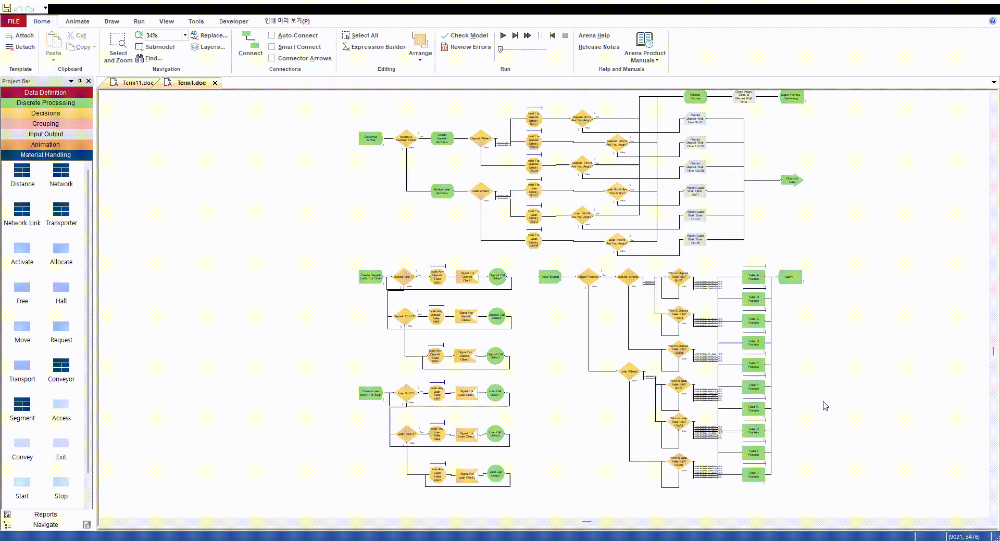
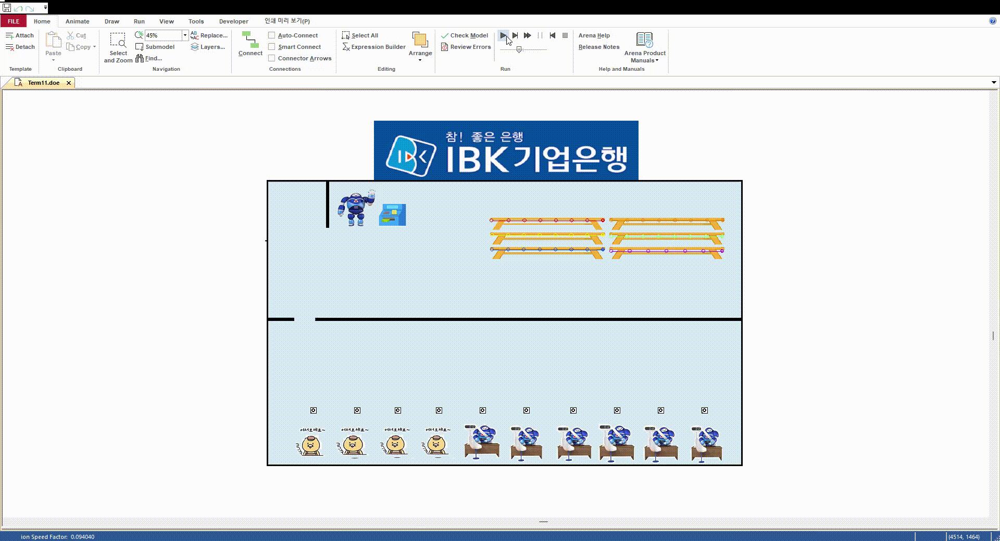

# 🏦 시뮬레이션 모델을 활용한 은행 고객 대기시간 최적화

**IBK 기업은행 고객 대기시간을 최적화하기 위한 시뮬레이션 모델입니다.**  
이 프로젝트는 Arena를 활용해 창구 업무의 비율 불균형과 점심시간 동안의 Capacity 감소 문제를 해결하고, 다양한 개선안을 통해 대기 시간을 줄이는 것을 목표로 합니다.

> 📊 **프로젝트 구성:** 데이터 수집, 모델 생성, 애니메이션화, 개선안 도출 및 검증

---

## 📋 데이터 수집
**직접 방문을 통해 수집한 데이터:**
- 방문 시간대: 오전 (09-11), 점심 (11-13), 오후 (13-16)  
- 수집 항목: 방문 고객 수, 대기 시간, 상담 시간  
- 수집 방법: 직접 내방해 목적별 데이터를 체크
- 수집된 데이터는 Arena Input Analyzer를 이용하여 분포 확인 후, 지수 분포 및 통계 검정을 통해 데이터의 적합성을 검토

---

## 🛠 사용 프로그램
- **Arena:** 공정 시뮬레이션 및 분석 도구  
  - 설치 링크: [Arena 다운로드](https://www.rockwellautomation.com/en-us/products/software/arena-simulation/buying-options/download.html)  
  - **주요 기능:** Resource와 Schedule을 활용한 업무 시간 및 인원 배치 최적화

---

## 🖥️ 간단한 프로세스 설명

- **모델 생성:**
  - 각 Resource와 Schedule을 활용해 은행 창구 직원의 업무 (예금, 대출) 및 출퇴근 시간, 점심 시간을 표현
- **목표:**
  - 창구 직원의 비율 및 점심시간 조정을 통해 현실적으로 창구 대기시간 감축
- 상세 프로세스는 [PPT 자료](./img/ppt.pdf)의 **10~16** 페이지를 참고해주세요.

---

## 🔄 개선안 정리
각 개선안의 상세한 지표는 [PPT 자료](./img/ppt.pdf)의 **18~26** 페이지를 참고해주세요.  
아래는 각 개선안의 특징과 간단한 평가입니다.

> ### 📌 개선안 α (점심시간 스케줄링 - General)
> - **핵심 내용:** 점심시간 동안의 Capacity 감소를 해결하기 위해 일부 행원의 점심 시간 단축 & 출근 시간 연기.  
> - **평가:** 전체 대기시간이 고르게 감소하며, 비교적 안정적인 개선 효과를 보임.

---

> ### 📌 개선안 β (점심시간 스케줄링 - Lunch)
> - **핵심 내용:** 모든 행원이 동일하게 45분의 점심 시간을 갖고, 창구별로 교대 간격을 조정.  
> - **평가:** 점심시간 동안 대기시간이 크게 감소하였으나, 일부 시간대에서 대기시간이 다소 증가.

---

> ### 📌 개선안 γ (창구 비율 조정 - Deposit)
> - **핵심 내용:** 예금 창구 인원을 증가시키고, 점심 이후 일부 인원은은 대출 창구로 복귀.  
> - **평가:** 예금 창구의 대기시간은 줄었으나, 대출 창구의 대기시간이 증가.

---

> ### 📌 개선안 δ (창구 비율 조정 - Hybrid)
> - **핵심 내용:** 특정 인원을 오전과 점심 시간 동안 모든 업무를 처리하도록 배치해 유휴 시간 최소화.  
> - **평가:** 전체적으로 대기시간이 줄었으나, 특정 창구의 대기시간이 증가하여 부담이 커짐.

---

## 🌀 애니메이션화

- **애니메이션 설명:** 실제 은행 창구와 유사하게 고객 흐름 및 대기 상황을 시각화

---

## 📄 참고자료
- [PPT 자료](./img/ppt.pdf)
- **참고 링크:**
  - [Arena 공식 홈페이지](https://www.arenasimulation.com/)

---

## ❓ 문의사항
**Issue**로 남겨주세요! 🙌
